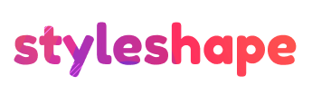

<h1 align="center">
  
</h1>

<h4 align="center">Because inline style can also be cool!</h4>

<p align="center">
  <a href="https://www.npmjs.com/package/styleshape" target="_blank">
    
  </a>
  <a href="https://github.com/renatorib/styleshape/stargazers" target="_blank">
    
  </a>
  <a href="https://twitter.com/intent/tweet?url=https://github.com/renatorib/styleshape" target="_blank">
    
  </a>
</p>

<p align="center">
   
</p>


<br />

## Explanations (must-read)

###### GOALS
Styleshape allows you to create stylized components using **inline css** (`style` prop). Unlike styled-components, styleshape does not parse/compile css and does not manage classes, that's why styleshape have **only 180 bytes** and **0 dependencies**. On the other hand you lose almost all the benefits of css like pseudo styles, autoprefixing, etc.

###### TRADEOFFS 
**Is Styleshape useful?** It depends, there are tradeoffs to consider.  
If you want to build complex UI, so **no**. You can not do simple things like putting a hover or nesting.  
If you want to create simple UI to your lib without placing heavy dependency on it, so **yes**, it's super useful.

## Usage & Examples
```js
import shape from "styleshape";
```

Simple styles:
```js 
const InputX = shape("input")({
  padding: "5px 10px",
  border: `1px solid #999`,
  borderRadius: "3px"
});

<InputX />
```

Passing props:
```js
const InputY = shape("input")(props => ({
  padding: "5px 10px",
  border: `1px solid ${props.error ? "#e11" : "#999"}`,
  borderRadius: "3px"
}));

<InputY error />
```

Stylizing other components:  
```js
// *Note: passed component must accept `style` prop*
const LargeInputY = shape(InputY)({
  padding: "10px 15px",
  fontSize: "20px"
});

<LargeInputY error />
```

[See at codesandbox](https://codesandbox.io/s/py6jo587px)

## Contribute

You can help improving this project sending PRs and helping with issues.  
Also you can ping me at [Twitter](http://twitter.com/renatorib_)
